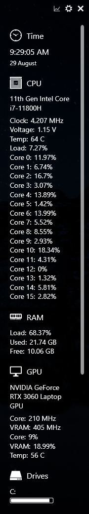
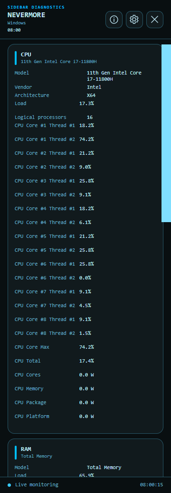
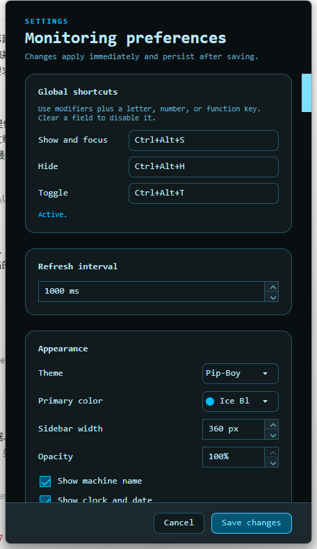

# Sidebar Diagnostics

Sidebar Diagnostics is a modern, cross-platform system monitor for Windows, macOS, and Linux. This independent Avalonia port preserves the original application's glanceable sidebar experience while replacing its Windows-only WPF foundation with a clean, testable architecture.

This repository is a modified work based on [ArcadeRenegade/SidebarDiagnostics](https://github.com/ArcadeRenegade/SidebarDiagnostics), created for the 2026 Avalonia Port Challenge. It is not an official release from the original maintainer.

## Highlights

- One native Avalonia application for Windows, macOS, and Linux
- CPU, memory, all mounted-volume, and primary-network monitoring
- Live bounded charts and configurable alert thresholds
- Broad hardware sensor support on Windows and standard hwmon sensors on Linux
- Searchable hardware sensor catalog with visibility, pinning, ordering, and custom names
- Vendor-neutral multi-GPU summaries for Intel, AMD, and NVIDIA devices
- Safe, graphable external JSON metrics from local files or explicit HTTP endpoints
- Resilient multi-display placement with mixed-DPI edge docking and primary-display fallback
- Native Windows AppBar integration that reserves the docked desktop work area
- Configurable global shortcuts for show/focus, hide, and visibility toggle
- High-density CPU, memory, GPU, drive, network, and hardware detail sections
- Configurable clock and date format, machine name, units, sidebar width, and opacity
- Optional cached external IP display with an explicit privacy control
- Live switching between the default Fluent-based appearance and the monochromatic Pip-Boy theme
- Tray controls and native launch-at-login integration on all three platforms
- Atomic JSON settings persistence
- Strict builds, unit tests, coverage artifacts, and locked restores
- Bounded single-flight hardware polling with cross-platform failure isolation
- Automated dependency, legacy-driver artifact, and long-running stability audits
- Self-contained release archives, macOS app bundles, and SHA-256 checksums

## Avalonia Port Challenge

This project is an entry in the [2026 Avalonia Port Challenge](https://avaloniaui.net/blog/avalonia-port-challenge). It targets **Best Cross-Platform Port**, **Best Legacy Revival**, **Best Everyday Tool**, and **Best IT Pro Tool**: Sidebar Diagnostics is a mature Windows utility whose core job—keeping detailed machine health visible at a glance—benefits directly from a careful cross-platform rebuild.

### Before and after

| Original .NET Framework 4.7.2 WPF application | Avalonia 12 and .NET 10 port |
| --- | --- |
|  |  |

The new UI keeps the dense, glanceable sidebar rather than reducing the application to a generic dashboard. It adds complete model and capacity information, per-core and hardware-sensor rows, responsive text layout, per-metric live chart windows, searchable sensor configuration, two live-switchable themes, and modern tray and settings experiences. Nonessential chrome still disappears when the pointer leaves the sidebar.

<p align="center">
  
</p>

### What the migration cost

This was a rewrite across four intensive calendar days, not a namespace substitution. The repository reached its first submission-ready state through 95 focused commits. At the time of this write-up, the hand-written application contains approximately 6,100 lines across 93 C# and AXAML files, plus approximately 1,300 lines of tests. The original application contains approximately 11,700 lines across 44 C# and XAML files when generated output is excluded. Those counts are a scale indicator, not a claim that fewer lines mean less work: most of the effort went into recovering behavior behind Windows-specific APIs and then proving the replacement on three operating systems.

The largest costs were outside the visual tree:

- separating monitoring, settings, window management, startup integration, shortcuts, and packaging from the WPF application singleton;
- replacing Windows performance counters with native Windows, Mach, `/proc`, and hwmon providers;
- preserving Windows AppBar work-area reservation without leaking that behavior into macOS or Linux code;
- making tray activation, close-to-tray, global shortcuts, launch-at-login, multi-display placement, and application reopen behavior honest on each desktop;
- making JSON, view creation, hardware integration, and packaging survive full trimming and Native AOT;
- repeatedly comparing the running port with the original so detailed information was restored instead of merely producing a visually similar shell.

### What translated cleanly

Avalonia's XAML, binding model, styles, resources, and desktop lifetime made the high-level WPF concepts familiar. Immutable snapshots and `CommunityToolkit.Mvvm` also made the presentation layer smaller and easier to test. Once each operating system produced the same metric models, CPU, memory, storage, network, GPU, sensor cards, alert state, and chart history could share one UI and one ViewModel.

The theme boundary worked especially well. Application views consume semantic resources instead of theme-specific colors. The default design uses Fluent control templates and the Sidebar palette; [Pipboy.Avalonia](https://github.com/NeverMorewd/Pipboy.Avalonia) can replace that theme at runtime and generate the monochromatic palette from one selected primary color. Existing windows update without reconstruction, while a cancelled settings preview restores the previous theme.

### What required rethinking

The original mixed WPF controls, performance counters, hardware access, shell integration, update behavior, and mutable settings in one Windows-oriented project. Translating those files directly would have produced a Windows application wearing Avalonia controls. The port instead starts at explicit boundaries: platform metric providers return immutable snapshots; hardware sensors, startup registration, global shortcuts, external sources, window placement, and reserved screen space are independent services; the ViewModels never need to know how `/proc/stat`, Mach host statistics, or `GetSystemTimes` work.

Some behavior was deliberately redesigned. Every graphable row now opens its own draggable, pinnable live chart instead of using one global graph configuration window. A curated semantic design system replaces arbitrary per-control fonts and colors. Updates are immutable GitHub Release artifacts with checksums rather than an in-process updater. The tray remains available because it is the safe recovery path for a hidden or click-through sidebar.

### The surprises

- Cross-platform did not mean using the same API everywhere. It meant presenting the same contract while respecting what each operating system can truthfully report.
- Network and volume enumeration needed selection policies. Virtual adapters, tunnels, container mounts, pseudo-filesystems, and WSL devices otherwise overwhelmed the sidebar.
- A visually successful port can still be functionally incomplete. Two late audits found settings that were persisted but no longer affected the current visual tree, and external JSON values that were sampled into an obsolete card pipeline. Tests and WPF-to-port parity reviews caught both.
- Native AOT exposed assumptions hidden by ordinary JIT builds. Source-generated JSON metadata, explicit view construction, platform-specific publish runners, and an isolated LibreHardwareMonitor compatibility boundary were necessary.
- Desktop integration is where platform differences are sharpest. Windows supports a true AppBar and native pointer pass-through; macOS and Linux use their own startup, activation, shortcut, tray, and window-manager conventions rather than pretending those Windows shell concepts exist unchanged.

### Result

One source tree now builds trimmed Native AOT artifacts for `win-x64`, `linux-x64`, `linux-arm64`, `osx-x64`, and `osx-arm64`. CI builds and tests on Windows, Ubuntu, and macOS, validates every Native AOT target on matching runners, packages conventional macOS `.app` bundles and Debian packages, generates WinGet and Homebrew metadata, and publishes checksums. The current test suite covers platform parsing, selection policies, settings normalization, chart histories, placement, alerts, startup files, package metadata, security checks, and failure recovery.

The result is not identical platform data disguised as parity. Windows retains broad LibreHardwareMonitor coverage and AppBar integration; Linux reads standard hwmon sensors; macOS uses stable public Mach and `sysctl` metrics and reports the absence of a public general-purpose hardware sensor API honestly. The detailed feature comparison is maintained in [the parity audit](docs/PARITY.md), and the implementation boundaries are documented in [the architecture notes](docs/ARCHITECTURE.md).

## Platform support

| Capability | Windows | macOS | Linux |
| --- | --- | --- | --- |
| CPU | `GetSystemTimes` | Mach CPU ticks, including per-core load | `/proc/stat`, including per-core load |
| Memory | `GlobalMemoryStatusEx` | Mach + `sysctl` | `/proc/meminfo` |
| Storage and network | .NET platform APIs | .NET platform APIs | .NET platform APIs |
| Hardware sensors | LibreHardwareMonitor | No stable public system API | hwmon temperature, fan, voltage, current, power, and clock readings |
| Tray and launch at login | Supported | Supported | Supported |
| Pointer pass-through | Supported | Not exposed | Not exposed |

Linux tray availability depends on StatusNotifierItem/AppIndicator support in the desktop environment. KDE Plasma supports it natively; GNOME may require the AppIndicator extension.

The detailed comparison with the WPF application is maintained in [docs/PARITY.md](docs/PARITY.md).

### Global shortcut support

Global shortcuts use a platform-neutral `Ctrl+Alt+Key` style syntax. Windows works without additional permissions. macOS requires Accessibility permission. X11 is supported through the native input hook. Wayland support depends on compositor and input-device permissions; the settings screen reports when the session denies global input access. Duplicate shortcuts are rejected without affecting the running monitor, and clearing a shortcut disables that action.

## Build and test

Install the .NET 10 SDK, then run:

```shell
dotnet restore SidebarDiagnostics.slnx --locked-mode
dotnet build SidebarDiagnostics.slnx --configuration Release --no-restore
dotnet test SidebarDiagnostics.slnx --configuration Release --no-build
dotnet run --project src/SidebarDiagnostics.App.csproj
```

## Repository layout

```text
src/                         Application and platform providers
tests/                       Unit tests
docs/                        Architecture and migration records
.github/workflows/           CI and release automation
SidebarDiagnostics.slnx      Repository solution
```

## Releases

Tags matching `v*` run tests on Windows, macOS, and Linux, publish trimmed Native AOT binaries for Windows x64, Linux x64/ARM64, and macOS x64/ARM64 on matching-architecture runners, create platform-native archives, generate SHA-256 checksums, and attach them to a GitHub Release. macOS artifacts contain a conventional `.app` bundle but are not code-signed or notarized.

For test builds, run the **Pre-release Native AOT** workflow from the GitHub Actions page. It can package Windows, Linux, macOS, or all platforms without creating a GitHub Release. The downloadable workflow artifacts are retained for 14 days and include SHA-256 checksums; Linux artifacts include both portable archives and Debian packages.

Each release also contains APT-installable Debian packages plus generated WinGet and Homebrew metadata tied to the immutable artifacts. Installation, upgrade, uninstall, rollback, community-index status, and Flatpak tradeoffs are documented in [docs/PACKAGE_MANAGERS.md](docs/PACKAGE_MANAGERS.md).

Package-manager installation from a tagged GitHub Release:

```powershell
winget install --manifest .\winget\<version>
```

```shell
brew install --cask ./homebrew/Casks/sidebar-diagnostics-avalonia.rb
sudo apt install ./SidebarDiagnostics-linux-x64.deb
```

The WinGet manifest and Homebrew Cask are inside the release metadata bundle. Public-index commands become available after their external repository reviews; the Debian package works directly with APT.

## Performance analysis

Two manually dispatched workflows use [DotNetPerformanceLab](https://github.com/NeverMorewd/DotNetPerformanceLab) to produce repeatable process, operating-system, and managed-runtime reports on dedicated self-hosted runners:

- **Performance - Repository application** publishes the selected x64 target as trimmed Native AOT and measures Sidebar Diagnostics.
- **Performance - External executable** measures an executable that already exists below an explicitly allowed directory on the runner. This is suitable for controlled comparisons with the original WPF application.

Each performance runner must have the `self-hosted`, `metric-test`, and matching `Windows`, `Linux`, or `macOS` labels. Configure required reviewers on the repository's `performance-lab` environment and run desktop applications from a signed-in interactive session. Reports include synchronized process and host metrics, complete `System.Runtime` counters, optional application meters, Markdown, normalized JSON and CSV, an offline Plotly dashboard, SVG charts, and an optional EventPipe trace.

Successful profiling runs update a GitHub Pages performance history containing unexpired report artifacts. In **Settings → Pages**, select **GitHub Actions** as the deployment source before the first run. Reports are retained for 14 days; the scheduled `Performance - Refresh report history` workflow rebuilds the site daily so expired artifacts also disappear from Pages when no new profile is executed.

Use the same physical machine, power profile, application state, duration, and iteration count when comparing builds. Results from different operating systems or machines are not directly comparable.

## Security and stability

The hardware access trust model and vulnerability reporting process are documented in [SECURITY.md](SECURITY.md). Repeatable timeout, artifact, dependency, and soak-test procedures are documented in [docs/STABILITY.md](docs/STABILITY.md).

## Themes

The default Sidebar theme uses Fluent control templates with a dedicated semantic palette. The optional Pip-Boy appearance uses [Pipboy.Avalonia](https://github.com/NeverMorewd/Pipboy.Avalonia) and maps the same application-level design tokens onto its generated monochromatic palette. Theme changes preview immediately in Settings, persist only when saved, and revert when the dialog is cancelled or closed.

## License and attribution

This modified work is distributed under the [GNU General Public License v3.0](LICENSE.md), matching the original project. The complete corresponding source is this repository. See [NOTICE.md](NOTICE.md) for the modification notice and [THIRD-PARTY-NOTICES.md](THIRD-PARTY-NOTICES.md) for dependency acknowledgements.
